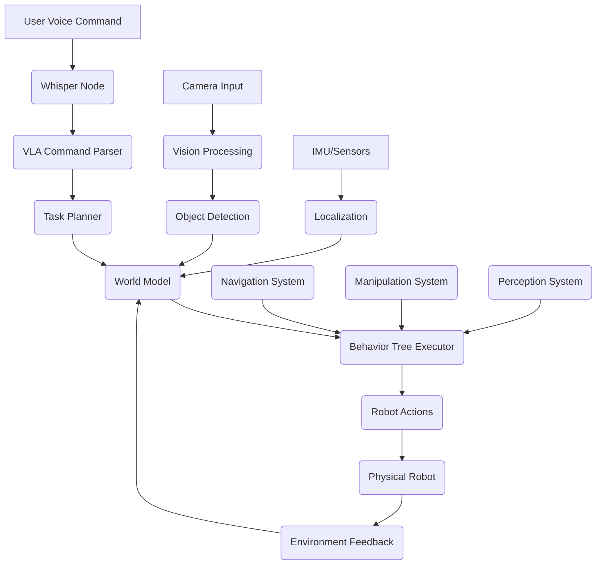

# Capstone Scenario: Voice-Controlled Humanoid Robot

## Overview

The capstone scenario integrates all the components explored in this module into a complete demonstration of Vision-Language-Action (VLA) capabilities. This scenario features a humanoid robot that receives voice input, processes it using multimodal AI models, plans complex behaviors, and executes them in a real-world environment. The scenario demonstrates the complete pipeline from human intention to robotic action.

## Learning Objectives

By the end of this section, you will be able to:
- Integrate all VLA system components into a complete application
- Design and implement a complete voice-controlled robotic system
- Test and validate integrated VLA capabilities
- Troubleshoot common integration issues
- Evaluate the performance of the complete system

## Capstone Scenario Description

### The Challenge

A humanoid robot must respond to natural language voice commands to navigate through a complex environment, identify and manipulate objects, and complete multi-step tasks. The robot receives a command like "Please go to the kitchen, find the red cup, pick it up, and bring it to me in the living room." This requires:

1. **Voice Processing**: Understanding the natural language command
2. **Perception**: Identifying the kitchen, the user, the red cup, and obstacles
3. **Planning**: Creating a sequence of actions to complete the task
4. **Execution**: Navigating, manipulating, and delivering the object
5. **Adaptation**: Handling unexpected situations during task execution

### System Architecture

The complete system architecture integrates multiple ROS 2 nodes:



## Implementation Components

### Voice Command Processing Node

This node processes voice commands and converts them to structured VLA commands:

```python
import rclpy
from rclpy.node import Node
from std_msgs.msg import String
from sensor_msgs.msg import AudioData
import whisper
import torch
import json

class VoiceCommandProcessor(Node):
    def __init__(self):
        super().__init__('voice_command_processor')

        # Publishers and subscribers
        self.voice_sub = self.create_subscription(
            AudioData, 'audio_input', self.audio_callback, 10)
        self.command_pub = self.create_publisher(String, 'vla_commands', 10)
        self.feedback_pub = self.create_publisher(String, 'voice_feedback', 10)

        # Whisper model
        self.whisper_model = whisper.load_model("base")

        # Command vocabulary
        self.command_vocab = {
            'navigation': ['go to', 'move to', 'navigate to', 'walk to', 'head to'],
            'manipulation': ['pick up', 'grasp', 'take', 'get', 'bring'],
            'delivery': ['bring to', 'deliver to', 'carry to'],
            'objects': ['cup', 'bottle', 'book', 'box', 'red cup', 'blue bottle', 'green book']
        }

    def audio_callback(self, msg):
        """Process incoming audio data."""
        try:
            # Convert audio to text using Whisper
            audio_data = self.convert_audio_data(msg)
            result = self.whisper_model.transcribe(audio_data)
            transcription = result['text'].lower().strip()

            self.get_logger().info(f"Transcribed: {transcription}")

            # Parse the command
            structured_command = self.parse_command(transcription)

            if structured_command:
                # Publish the structured command
                cmd_msg = String()
                cmd_msg.data = json.dumps(structured_command)
                self.command_pub.publish(cmd_msg)

                # Provide feedback
                feedback_msg = String()
                feedback_msg.data = f"Understood command: {transcription}"
                self.feedback_pub.publish(feedback_msg)
            else:
                feedback_msg = String()
                feedback_msg.data = f"Command not understood: {transcription}"
                self.feedback_pub.publish(feedback_msg)

        except Exception as e:
            self.get_logger().error(f"Error processing audio: {e}")

    def convert_audio_data(self, audio_msg):
        """Convert ROS AudioData to format expected by Whisper."""
        # Implementation would convert audio format
        # This is a simplified placeholder
        import numpy as np

        # Convert byte data to numpy array
        audio_array = np.frombuffer(audio_msg.data, dtype=np.int16)
        audio_array = audio_array.astype(np.float32) / 32768.0  # Normalize

        return audio_array

    def parse_command(self, text):
        """Parse natural language command into structured format."""
        # Identify command type
        command_type = self.identify_command_type(text)

        if not command_type:
            return None

        # Extract entities (objects, locations)
        entities = self.extract_entities(text)

        # Structure the command
        structured_command = {
            'type': command_type,
            'original_text': text,
            'entities': entities,
            'timestamp': self.get_clock().now().nanoseconds
        }

        return structured_command

    def identify_command_type(self, text):
        """Identify the type of command from the text."""
        for cmd_type, patterns in self.command_vocab.items():
            for pattern in patterns:
                if pattern in text:
                    return cmd_type

        return None

    def extract_entities(self, text):
        """Extract objects and locations from the command."""
        entities = {
            'objects': [],
            'locations': [],
            'people': []
        }

        # Extract objects
        for obj in self.command_vocab['objects']:
            if obj in text:
                entities['objects'].append(obj)

        # Extract common locations
        locations = ['kitchen', 'living room', 'bedroom', 'office', 'dining room', 'bathroom']
        for loc in locations:
            if loc in text:
                entities['locations'].append(loc)

        # Extract people references
        if 'me' in text or 'my' in text:
            entities['people'].append('user')

        return entities
```

### VLA Integration Node

This node integrates vision, language, and action components:

```python
import rclpy
from rclpy.node import Node
from sensor_msgs.msg import Image
from std_msgs.msg import String
from geometry_msgs.msg import Twist, Pose
from visualization_msgs.msg import MarkerArray
import torch
import torchvision.transforms as T
from PIL import Image as PILImage
import json

class VLAIntegrationNode(Node):
    def __init__(self):
        super().__init__('vla_integration_node')

        # Publishers and subscribers
        self.image_sub = self.create_subscription(
            Image, '/camera/image_raw', self.image_callback, 10)
        self.command_sub = self.create_subscription(
            String, 'vla_commands', self.command_callback, 10)
        self.action_pub = self.create_publisher(Twist, '/cmd_vel', 10)
        self.manipulation_pub = self.create_publisher(String, '/manipulation_commands', 10)
        self.debug_pub = self.create_publisher(MarkerArray, '/vla_debug', 10)

        # VLA model (placeholder - in practice would load actual model)
        self.vla_model = self.load_vla_model()

        # Transform for image preprocessing
        self.transform = T.Compose([
            T.Resize((224, 224)),
            T.ToTensor(),
            T.Normalize(mean=[0.485, 0.456, 0.406],
                       std=[0.229, 0.224, 0.225])
        ])

        # State management
        self.current_image = None
        self.current_command = None
        self.inference_timer = self.create_timer(0.1, self.run_inference)

        # Object detection model (for object identification)
        self.object_detector = self.load_object_detector()

    def load_vla_model(self):
        """Load the VLA model."""
        # In practice, this would load an actual VLA model
        # For this example, we'll create a mock implementation
        class MockVLA:
            def __call__(self, image, command):
                # Mock implementation that returns actions based on command
                if 'navigate' in command.lower() or 'go to' in command.lower():
                    return {'action': 'navigation', 'params': {'speed': 0.5, 'direction': 'forward'}}
                elif 'pick up' in command.lower() or 'grasp' in command.lower():
                    return {'action': 'manipulation', 'params': {'object': 'target_object'}}
                else:
                    return {'action': 'idle', 'params': {}}

        return MockVLA()

    def load_object_detector(self):
        """Load object detection model."""
        # Placeholder for object detection model
        class MockObjectDetector:
            def detect(self, image):
                # Mock object detection
                return [{'class': 'cup', 'confidence': 0.9, 'bbox': [100, 100, 200, 200]}]

        return MockObjectDetector()

    def image_callback(self, msg):
        """Process incoming image data."""
        try:
            # Convert ROS Image to tensor
            image_tensor = self.ros_image_to_tensor(msg)
            self.current_image = image_tensor
        except Exception as e:
            self.get_logger().error(f"Image conversion error: {e}")

    def command_callback(self, msg):
        """Process incoming VLA command."""
        try:
            # Parse the structured command
            command_data = json.loads(msg.data)
            self.current_command = command_data
        except json.JSONDecodeError:
            self.get_logger().error("Invalid JSON in command message")
        except Exception as e:
            self.get_logger().error(f"Command processing error: {e}")

    def ros_image_to_tensor(self, img_msg):
        """Convert ROS Image message to tensor."""
        import numpy as np

        # Convert ROS image to numpy array
        img_array = np.frombuffer(img_msg.data, dtype=np.uint8)
        height, width = img_msg.height, img_msg.width
        img_array = img_array.reshape((height, width, -1))

        # Convert to PIL and apply transforms
        pil_img = PILImage.fromarray(img_array)
        tensor_img = self.transform(pil_img)

        return tensor_img

    def run_inference(self):
        """Run VLA inference when both image and command are available."""
        if self.current_image is not None and self.current_command is not None:
            try:
                # Process with VLA model
                action = self.process_vla_inference(
                    self.current_image, self.current_command)

                if action:
                    self.execute_action(action)

                # Clear command to avoid repeated execution
                self.current_command = None

            except Exception as e:
                self.get_logger().error(f"VLA inference error: {e}")

    def process_vla_inference(self, image, command):
        """Process VLA inference with image and command."""
        # Run object detection to identify relevant objects
        detected_objects = self.object_detector.detect(image)

        # Find target object based on command
        target_object = self.find_target_object(
            detected_objects, command['entities'])

        # Generate action based on command and detected objects
        action = self.generate_action(command, target_object)

        return action

    def find_target_object(self, detected_objects, command_entities):
        """Find the target object based on command entities."""
        for obj in detected_objects:
            for target_obj in command_entities.get('objects', []):
                if target_obj.lower() in obj['class'].lower():
                    return obj

        return None

    def generate_action(self, command, target_object):
        """Generate action based on command and target object."""
        cmd_type = command['type']

        if cmd_type == 'navigation':
            if command['entities']['locations']:
                return {
                    'action_type': 'navigation',
                    'target_location': command['entities']['locations'][0],
                    'speed': 0.5
                }
        elif cmd_type == 'manipulation':
            if target_object:
                return {
                    'action_type': 'manipulation',
                    'target_object': target_object,
                    'action': 'grasp'
                }
            else:
                return {
                    'action_type': 'perception',
                    'action': 'search',
                    'target': command['entities']['objects'][0] if command['entities']['objects'] else 'unknown'
                }

        return None

    def execute_action(self, action):
        """Execute the generated action."""
        action_type = action.get('action_type', 'idle')

        if action_type == 'navigation':
            self.execute_navigation_action(action)
        elif action_type == 'manipulation':
            self.execute_manipulation_action(action)
        elif action_type == 'perception':
            self.execute_perception_action(action)

    def execute_navigation_action(self, action):
        """Execute navigation action."""
        # Create navigation command
        nav_msg = Twist()
        nav_msg.linear.x = action.get('speed', 0.5)
        nav_msg.angular.z = 0.0  # For simplicity, assume straight line

        self.action_pub.publish(nav_msg)

        self.get_logger().info(f"Executing navigation to: {action.get('target_location')}")

    def execute_manipulation_action(self, action):
        """Execute manipulation action."""
        manip_msg = String()
        manip_msg.data = f"grasp_object:{action['target_object']['class']}"

        self.manipulation_pub.publish(manip_msg)

        self.get_logger().info(f"Executing manipulation: {action['action']} on {action['target_object']['class']}")

    def execute_perception_action(self, action):
        """Execute perception action."""
        self.get_logger().info(f"Executing perception: {action['action']} for {action['target']}")
```

### Task Planning and Execution Node

This node manages the complete task execution flow:

```python
import rclpy
from rclpy.node import Node
from std_msgs.msg import String
from geometry_msgs.msg import Pose
from action_msgs.msg import GoalStatus
import json
import time

class CapstoneTaskExecutor(Node):
    def __init__(self):
        super().__init__('capstone_task_executor')

        # Publishers and subscribers
        self.command_sub = self.create_subscription(
            String, 'vla_commands', self.command_callback, 10)
        self.status_pub = self.create_publisher(String, 'task_status', 10)
        self.navigation_pub = self.create_publisher(Pose, 'navigation_goal', 10)
        self.manipulation_pub = self.create_publisher(String, 'manipulation_commands', 10)

        # Task state
        self.current_task = None
        self.task_state = 'idle'
        self.world_model = WorldModel()

        # Location database
        self.locations = {
            'kitchen': Pose(position={'x': 5.0, 'y': 3.0, 'z': 0.0}),
            'living room': Pose(position={'x': 1.0, 'y': 1.0, 'z': 0.0}),
            'office': Pose(position={'x': 8.0, 'y': 1.0, 'z': 0.0})
        }

    def command_callback(self, msg):
        """Process incoming command for the capstone scenario."""
        try:
            command_data = json.loads(msg.data)

            self.get_logger().info(f"Starting capstone task: {command_data}")

            # Update task state
            self.task_state = 'executing'
            self.current_task = command_data

            # Execute the capstone scenario
            success = self.execute_capstone_scenario(command_data)

            # Publish final status
            status_msg = String()
            status_msg.data = f"Capstone task: {'success' if success else 'failed'}"
            self.status_pub.publish(status_msg)

            self.task_state = 'idle'

        except Exception as e:
            self.get_logger().error(f"Capstone task execution error: {e}")
            self.task_state = 'idle'

    def execute_capstone_scenario(self, command_data):
        """Execute the complete capstone scenario."""
        try:
            # Parse the command to extract task steps
            task_steps = self.parse_capstone_command(command_data)

            self.get_logger().info(f"Executing {len(task_steps)} task steps")

            # Execute each step
            for i, step in enumerate(task_steps):
                self.get_logger().info(f"Executing step {i+1}/{len(task_steps)}: {step['action']}")

                success = self.execute_task_step(step)

                if not success:
                    self.get_logger().error(f"Task step {i+1} failed: {step}")
                    return False

                # Update status
                status_msg = String()
                status_msg.data = f"Step {i+1}/{len(task_steps)} completed: {step['action']}"
                self.status_pub.publish(status_msg)

            return True

        except Exception as e:
            self.get_logger().error(f"Capstone scenario execution error: {e}")
            return False

    def parse_capstone_command(self, command_data):
        """Parse the capstone command into executable steps."""
        entities = command_data['entities']
        cmd_type = command_data['type']

        steps = []

        # Navigation step
        if entities['locations']:
            steps.append({
                'action': 'navigate',
                'target_location': entities['locations'][0],
                'description': f'Navigate to {entities["locations"][0]}'
            })

        # Object search step
        if entities['objects']:
            steps.append({
                'action': 'search',
                'target_object': entities['objects'][0],
                'description': f'Search for {entities["objects"][0]}'
            })

        # Manipulation step
        if entities['objects']:
            steps.append({
                'action': 'grasp',
                'target_object': entities['objects'][0],
                'description': f'Grasp {entities["objects"][0]}'
            })

        # Delivery step (if there are multiple locations)
        if len(entities['locations']) > 1:
            steps.append({
                'action': 'navigate',
                'target_location': entities['locations'][1],
                'description': f'Deliver to {entities["locations"][1]}'
            })

        return steps

    def execute_task_step(self, step):
        """Execute a single task step."""
        action = step['action']

        if action == 'navigate':
            return self.execute_navigation_step(step)
        elif action == 'search':
            return self.execute_search_step(step)
        elif action == 'grasp':
            return self.execute_grasp_step(step)
        else:
            self.get_logger().error(f"Unknown action: {action}")
            return False

    def execute_navigation_step(self, step):
        """Execute navigation step."""
        target_location = step['target_location']

        if target_location in self.locations:
            # Publish navigation goal
            goal_pose = self.locations[target_location]
            self.navigation_pub.publish(goal_pose)

            self.get_logger().info(f"Navigating to {target_location}")

            # Simulate navigation time
            time.sleep(3)  # Simulate navigation

            return True
        else:
            self.get_logger().error(f"Unknown location: {target_location}")
            return False

    def execute_search_step(self, step):
        """Execute object search step."""
        target_object = step['target_object']

        self.get_logger().info(f"Searching for {target_object}")

        # Simulate search time
        time.sleep(2)

        # For this example, assume object is found
        # In practice, this would interface with perception system
        self.get_logger().info(f"Found {target_object}")

        return True

    def execute_grasp_step(self, step):
        """Execute object grasp step."""
        target_object = step['target_object']

        # Publish manipulation command
        manip_msg = String()
        manip_msg.data = f"grasp:{target_object}"
        self.manipulation_pub.publish(manip_msg)

        self.get_logger().info(f"Grasping {target_object}")

        # Simulate grasp time
        time.sleep(2)

        return True

class WorldModel:
    """Simple world model for the capstone scenario."""
    def __init__(self):
        self.objects = {}
        self.locations = {}
        self.robot_state = {'position': {'x': 0, 'y': 0, 'z': 0}, 'holding': None}

    def update_object_location(self, obj_name, location):
        """Update the location of an object."""
        self.objects[obj_name] = {'location': location, 'status': 'available'}

    def get_object_location(self, obj_name):
        """Get the location of an object."""
        if obj_name in self.objects:
            return self.objects[obj_name]['location']
        return None
```

## Complete System Integration

### Main Capstone Node

This node coordinates all the components:

```python
def main(args=None):
    rclpy.init(args=args)

    # Create all nodes
    voice_processor = VoiceCommandProcessor()
    vla_integration = VLAIntegrationNode()
    task_executor = CapstoneTaskExecutor()

    # Create executor to run multiple nodes
    executor = rclpy.executors.MultiThreadedExecutor()
    executor.add_node(voice_processor)
    executor.add_node(vla_integration)
    executor.add_node(task_executor)

    try:
        executor.spin()
    except KeyboardInterrupt:
        pass
    finally:
        # Cleanup
        voice_processor.destroy_node()
        vla_integration.destroy_node()
        task_executor.destroy_node()
        rclpy.shutdown()

if __name__ == '__main__':
    main()
```

## Testing the Capstone Scenario

### Test Cases

Create comprehensive test cases for the capstone scenario:

```python
import unittest
from unittest.mock import Mock, patch
import rclpy
from std_msgs.msg import String

class TestCapstoneScenario(unittest.TestCase):
    def setUp(self):
        rclpy.init()
        self.task_executor = CapstoneTaskExecutor()

    def tearDown(self):
        self.task_executor.destroy_node()
        rclpy.shutdown()

    def test_simple_navigation_task(self):
        """Test a simple navigation task."""
        command = {
            'type': 'navigation',
            'entities': {
                'locations': ['kitchen'],
                'objects': [],
                'people': []
            }
        }

        command_msg = String()
        command_msg.data = json.dumps(command)

        # Mock the publisher to capture output
        with patch.object(self.task_executor.status_pub, 'publish') as mock_pub:
            self.task_executor.command_callback(command_msg)

            # Check that status was published
            self.assertTrue(mock_pub.called)

    def test_complete_capstone_task(self):
        """Test the complete capstone scenario."""
        command = {
            'type': 'delivery',
            'entities': {
                'locations': ['kitchen', 'living room'],
                'objects': ['red cup'],
                'people': ['user']
            }
        }

        command_msg = String()
        command_msg.data = json.dumps(command)

        # Execute the complete task
        success = self.task_executor.execute_capstone_scenario(command)

        # The task should complete successfully
        self.assertTrue(success)

if __name__ == '__main__':
    unittest.main()
```

## Performance Evaluation

### Metrics for Capstone Scenario

Evaluate the performance of the complete system:

```python
class CapstoneEvaluator:
    def __init__(self, node):
        self.node = node
        self.metrics = {
            'task_completion_rate': 0.0,
            'average_execution_time': 0.0,
            'voice_recognition_accuracy': 0.0,
            'object_detection_accuracy': 0.0,
            'navigation_success_rate': 0.0
        }
        self.test_results = []

    def evaluate_scenario(self, test_case):
        """Evaluate the capstone scenario with a specific test case."""
        start_time = time.time()

        # Execute the test case
        success = self.execute_test_case(test_case)

        execution_time = time.time() - start_time

        # Record results
        result = {
            'test_case': test_case,
            'success': success,
            'execution_time': execution_time,
            'timestamp': time.time()
        }

        self.test_results.append(result)

        # Update metrics
        self.update_metrics(result)

        return result

    def update_metrics(self, result):
        """Update performance metrics based on test result."""
        # Update task completion rate
        successful_tasks = [r for r in self.test_results if r['success']]
        self.metrics['task_completion_rate'] = len(successful_tasks) / len(self.test_results)

        # Update average execution time
        if self.test_results:
            total_time = sum(r['execution_time'] for r in self.test_results)
            self.metrics['average_execution_time'] = total_time / len(self.test_results)

    def generate_evaluation_report(self):
        """Generate a comprehensive evaluation report."""
        report = {
            'total_tests': len(self.test_results),
            'successful_tests': len([r for r in self.test_results if r['success']]),
            'metrics': self.metrics,
            'detailed_results': self.test_results
        }

        return report
```

## Troubleshooting Common Issues

### Integration Problems

Common issues in VLA integration and their solutions:

1. **Timing Issues**: VLA models may process inputs at different rates
   - Solution: Implement proper buffering and synchronization

2. **Resource Conflicts**: Multiple AI models competing for GPU resources
   - Solution: Use model optimization and resource scheduling

3. **Communication Delays**: ROS 2 message passing delays
   - Solution: Optimize message frequency and use appropriate QoS settings

4. **State Synchronization**: World model not updating correctly
   - Solution: Implement proper state propagation mechanisms

### Performance Optimization

```python
class CapstoneOptimizer:
    def __init__(self):
        self.optimization_strategies = {
            'model_quantization': self.apply_model_quantization,
            'input_buffering': self.setup_input_buffering,
            'task_parallelization': self.enable_task_parallelization,
            'resource_management': self.optimize_resource_usage
        }

    def apply_model_quantization(self):
        """Apply model quantization for faster inference."""
        # Convert models to lower precision for faster execution
        pass

    def setup_input_buffering(self):
        """Setup proper input buffering to handle timing differences."""
        # Implement circular buffers for image and audio inputs
        pass

    def enable_task_parallelization(self):
        """Enable parallel execution of independent tasks."""
        # Use threading or multiprocessing for independent operations
        pass

    def optimize_resource_usage(self):
        """Optimize GPU and CPU resource allocation."""
        # Implement resource scheduling and allocation strategies
        pass
```

## Deployment Considerations

### Hardware Requirements

For deploying the complete capstone scenario:

- **GPU**: NVIDIA Jetson Xavier NX or equivalent for VLA model inference
- **CPU**: Multi-core processor for ROS 2 nodes and task execution
- **Memory**: 8GB+ RAM for model loading and processing
- **Sensors**: RGB-D camera, IMU, encoders for navigation
- **Communication**: WiFi/Ethernet for cloud connectivity (optional)

### Safety Measures

Implement safety measures for the complete system:

```python
class CapstoneSafetyManager:
    def __init__(self, node):
        self.node = node
        self.emergency_stop_active = False
        self.safety_thresholds = {
            'distance_to_obstacle': 0.5,  # meters
            'execution_time_limit': 300,  # seconds
            'confidence_threshold': 0.7
        }

    def check_safety_conditions(self):
        """Check if it's safe to continue task execution."""
        if self.emergency_stop_active:
            return False

        # Check obstacle distance
        if self.get_distance_to_nearest_obstacle() < self.safety_thresholds['distance_to_obstacle']:
            self.node.get_logger().warn("Obstacle too close, stopping execution")
            return False

        return True

    def get_distance_to_nearest_obstacle(self):
        """Get distance to nearest obstacle from sensors."""
        # Interface with laser scanner or depth sensor
        # Return minimum distance to obstacle
        pass

    def emergency_stop(self):
        """Activate emergency stop."""
        self.emergency_stop_active = True
        # Publish stop commands to all actuators
        pass
```

## Summary

The capstone scenario demonstrates the complete integration of Vision-Language-Action capabilities in a humanoid robot system. This scenario combines voice processing, multimodal AI models, task planning, and execution to create a sophisticated cognitive robotic system that can understand and respond to natural language commands in real-world environments.

The successful implementation of this capstone scenario represents the culmination of all the concepts explored in this module, from basic VLA model integration to complex task planning and execution. The system demonstrates how multiple AI and robotics components can work together to create intelligent, responsive robotic behaviors.

This completes the Vision-Language-Action Integration module, providing a comprehensive foundation for developing cognitive robotic systems that can understand and respond to human commands in complex, real-world environments.